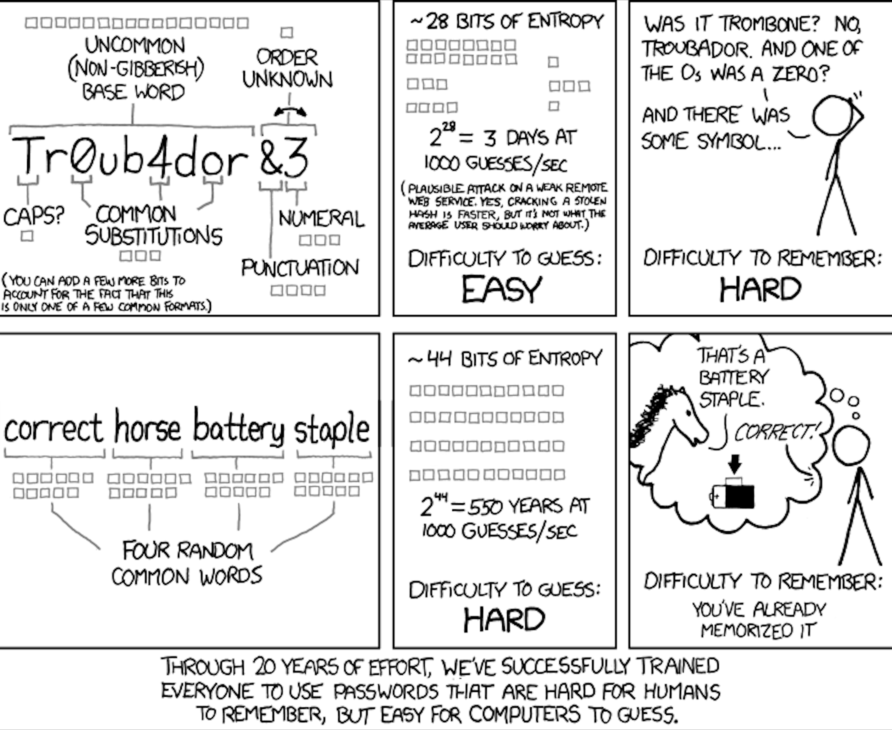

Cs50 Cybersecurity Assignment 0

https://cs50.harvard.edu/cybersecurity/2023/assignments/0/

#### Grade: 10/10

## 1. Why might being required to change our passwords regularly actually pose a threat to our security?
Changing the password regularly pose a threat to our security because of some of the following reasons:
It can increase the chances of forgetting the password and making the account vulnerable when trying to recover the password.
The person could write the password down in a piece of paper or on their own computer in some note application, creating an easy access to the adversary.
The person could not make that much of an effort when changing the password and leaving it too similar to the previous ones, so if the previous passwords had leaked, adversaries might have a hint of the new password.

## 2. If I have a six-character password consisting of uppercase (English) letters and (decimal) digits only, how many seconds might it take an adversary to crack, assuming they make one attempt per second?
Considering a password consisting with 6 digits of only uppercase letters and decimal digits, an adversary would take 2.176.782.336 seconds (36 to the sixth power) to crack the password. 

## 3. Humor us for a moment, and play The Password Game, trying to get through at least Rule 12 https://neal.fun/password-game/. While obviously the game itself is in many ways meant to be humorous, it also critiques the experience many of us have setting up new passwords. Explain how there's a trade-off between usability and security in the context of passwords.

When a program is being developed, programmers wants the users to actually use the programs, so if the password is too hard for humans to remember, they will eventually stop using that program or not even start using it.

## Consider the below comic for the next two questions.


## 4. Consider the top row of the comic above. Why are passwords like those easy (for a computer) to guess but hard (for a human) to remember?
Because it’s not a dictionary word, that word is not part of humans vocabulary so it’s easy for humans to forget what is not part of their daily life. As for the computer, when cracking a password, it’s about the length and how many digits, upper and lower case letters, and punctuation the password has, since the computer will search character by character of a password and not a whole word, turning it easy for computers to crack it if the password is too small.

## 5. Now consider the bottom row of the comic above. Why are passwords like those hard (for a computer) to guess but easy (for a human) to remember?
Because those are dictionary words and part of words humans use on a daily basis, humans tend to associate words with images, making it easy for them to remember a password like that. As for the computer, when trying to crack a password too long in length, it will also take too long in time to crack it, turning the cracking not worth for someone trying it.

## 6. What is a "credential stuffing" attack?
A credential stuffing attack is when the adversary already knows a username and password that they got from a database or from a different website or application and try those same password and username into another account because chances are high that the victim is using the same credentials to access other websites, apps and so on.

## 7. Provide an example of something that would be considered a knowledge factor for authentication purposes.
A knowledge factor for authentication purpose is something that someone knows, like their password that no one else should know and allow them to authenticate themselves to get access to an specific account, like an e-mail or bank account.

## 8. Provide an example of something that would be considered an inherence factor for authentication purposes.
Inheritance for authentication purposes is something that is unique to someone, generally described as biometrics, for example: a fingerprint or face that will prove that someone is actually who they saying they are.

## 9. Why are phishing attacks so difficult to prevent?
Phishing are difficult to prevent because it’s all about what and how someone shares their personal information and how aware they are when receiving a e-mail, for example, asking for their information or to click a link from some highly used account for that particular person, could be a fake e-mail from PayPal asking to update their information. If the person is not aware that the e-mail is not legit they can have their information stolen.

## 10. Suppose that your boss asks you whether the company should require use of password managers for all employees. Explain in a short paragraph why you might want everyone in the company to use a password manager. 
It’s a good practice to use a password manager because of all the benefits that come with it, such as remembering the passwords and even generating a strong password for the employees, in this case. Another great benefit is that when visiting a website for a second time, after saving that password on the password manager, the manager will remember that url and allow the employees to access that site with just a combination of keywords or a fingerprint, and if it’s a fake website trying to steal information, chances are high that the employees will notice easily, and make the access for adversaries to the company’s and employees’ information harder.
