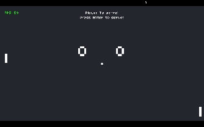
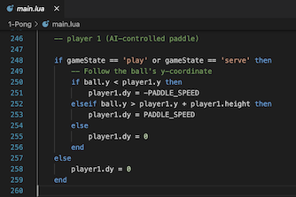

# 1. PONG

### Assigment 0: 
### - Implement a basic AI for either Player 1 or 2 (or both!).

link: https://cs50.harvard.edu/games/2018/projects/0/pong/

In this assigment I implemented an AI for the left paddle, as shown bellow.

 

Assignment grade: 1/1

# 2. FLAPPY BIRD

### Assigment 1: 

### - Randomize the gap between pipes (vertical space), such that they’re no longer hardcoded to 90 pixels.
### - Randomize the interval at which pairs of pipes spawn, such that they’re no longer always 2 seconds apart.
### - When a player enters the ScoreState, award them a “medal” via an image displayed along with the score. Choose 3 different ones, as well as the minimum score needed for each one.
### - Implement a pause feature, such that the user can simply press “P” (or some other key) and pause the state of the game:

#### &nbsp; &nbsp; a. When they pause the game, a simple sound effect should play.
#### &nbsp; &nbsp; b. At the same time this sound effect plays, the music should pause.
#### &nbsp; &nbsp; c. Once the user presses P again, the gameplay and the music should resume just as they were!
#### &nbsp; &nbsp; d. To cap it off, display a pause icon in the middle of the screen, nice and large, so as to make it clear the game is paused.

link: https://cs50.harvard.edu/games/2018/projects/1/flappy/

